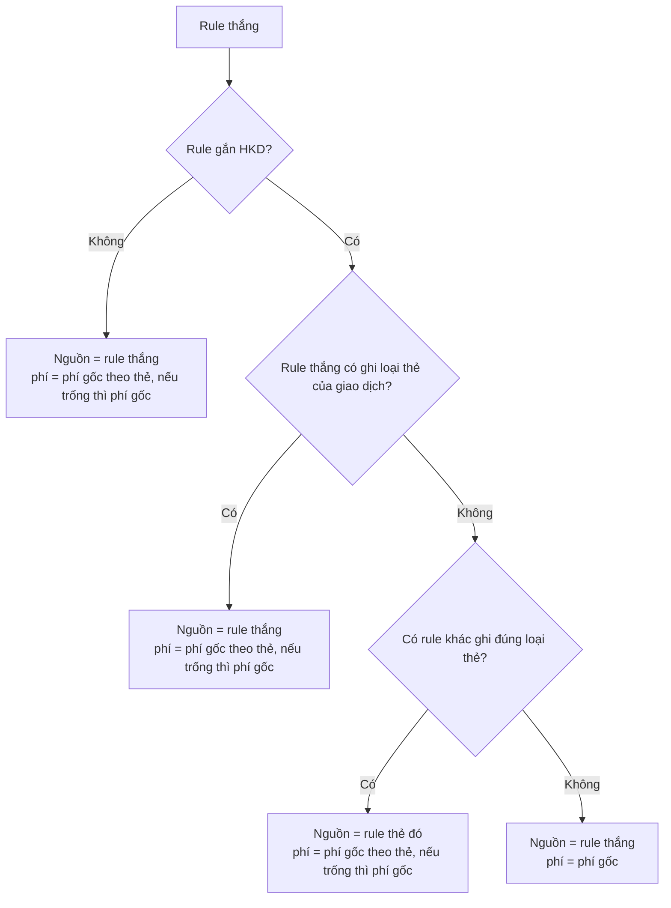

# Spec: tính phí gốc theo thẻ lúc tạo giao dịch

Trạng thái: đã implement và chạy local, gồm cả mục 7 (giữ dòng "Phí gốc lấy từ" sau khi duyệt), mục 8 (rule hộ đã ghi thẻ) và đổi nhãn "Phí dùng để tính". 329 spec qua (`services`, `jobs`, `requests`, `models`, `system`). Giao dịch #10 đã được tính lại theo logic này. Chưa commit.

Phạm vi: bước tính tiền sau OCR (`Transactions::Evaluator`), tính lại khi sửa hoặc duyệt (`Transactions::Recalculator`), màn chi tiết giao dịch. Không đổi `Transactions::Calculator`. Không đổi thứ tự chọn rule của `FeeRules::Resolver.call`. File Kết toán theo phí gốc chỉ đổi một chỗ ở cột D của thẻ `mb` và `napas` (mục 5.4 và 6), xem `SPEC_QUY_TAC_MB_NAPAS.md`.

Tên gọi giữ nguyên: Phí gốc = `base_fee_rate`. Phí gốc theo thẻ = `card_base_fee_rate`. Phí đại lý = `dealer_rate`.

## 1. Root cause

Giao dịch #9 (thẻ MB, hộ `099`) cho thấy hai lỗi cùng gốc.

Resolver chọn đúng một rule thắng theo độ cụ thể: HKD + thẻ, đại lý + thẻ, HKD, đại lý, chỉ thẻ, mặc định. Rule #6 gắn đúng hộ `099`, không gắn loại thẻ, nên mức “HKD” thắng rule #2 mức “chỉ theo loại thẻ”. Trước thay đổi này, mọi số lúc tạo giao dịch đều lấy từ rule thắng:

| Số | Nguồn trước đây | Giá trị #9 trước đây | Mong muốn |
|---|---|---|---|
| Phí dùng để tính số tiền sau phí gốc | rule #6 | `1,21%` | `0,88%` của rule #2, vì giao dịch là thẻ MB |
| Phí đại lý | rule #6 | `1,40%` | `1,20%` của rule #2 |
| Số tiền sau khi trừ phí gốc | rule #6 | `77.010.361` | Tính theo `0,88%` (giao dịch #10 ra `77.267.014`) |

Hệ quả: số tiền sau phí gốc và lợi nhuận trên giao dịch lệch so với cột C, D, E của file Excel thẻ MB, vì file đó vốn đã đọc rule thẻ lúc xuất.

## 2. Solution

Rule thắng vẫn là rule của hộ. Sau khi có rule thắng, hệ thống chọn thêm **rule nguồn** cho phí gốc. Phí đại lý đi theo rule nguồn.

### 2.1 Quy tắc

| Trường hợp | Phí tính số tiền sau phí gốc | Phí đại lý |
|---|---|---|
| 1. Rule hộ không ghi loại thẻ của giao dịch (để trống mọi thẻ, như #6), có rule khác ghi đúng thẻ | Phí gốc theo thẻ của rule thẻ, nếu trống thì phí gốc của rule thẻ | `dealer_rate` của rule thẻ. Rule thẻ không có thì giữ của rule thắng |
| 1b. Như trên, nhưng không có rule thẻ nào | Phí gốc của rule hộ | `dealer_rate` của rule hộ |
| 2. Rule hộ có ghi loại thẻ của giao dịch | Phí gốc theo thẻ của chính nó, nếu trống thì phí gốc của chính nó. Không mượn rule khác | `dealer_rate` của rule hộ |
| 3. Rule thắng không gắn HKD | Phí gốc theo thẻ, nếu trống thì phí gốc | `dealer_rate` của rule thắng |

Trường hợp 2 gộp 2a (có phí gốc theo thẻ) và 2b cũ. Rule có phí gốc theo thẻ luôn ghi ít nhất một loại thẻ. Rule thắng do resolver chọn luôn bao phủ loại thẻ của giao dịch, nên rule hộ có ghi thẻ luôn rơi vào trường hợp 2. Rule hộ không ghi loại thẻ giao dịch chỉ xảy ra với rule để trống mọi thẻ, hoặc khi người duyệt chọn tay một rule phí: khi đó áp dụng trường hợp 1 và 1b. File xuất đọc số đã lưu trên giao dịch nên luôn khớp với cách tính này (xem mục 8).

Chọn rule thẻ ở trường hợp 1: rule còn hiệu lực tại `transaction_at`, đang bật, có ghi đúng `card_type_id`, đại lý để trống hoặc bằng đại lý của giao dịch, hộ để trống hoặc có hộ của giao dịch, bỏ rule thắng ra. Lấy mức cụ thể nhất, rồi `priority` nhỏ nhất. Còn nhiều hơn một rule thì lấy rule tạo trước (`id` nhỏ nhất) và đánh dấu hòa: giao dịch có lý do `card_fee_rule_ambiguous`, vào Cần kiểm tra, không tự duyệt.

### 2.2 Duyệt tay

Không thêm lý do duyệt tay nào cho các trường hợp trong bảng 2.1. Giao dịch tính theo phí gốc theo thẻ (trường hợp 1, 2) vẫn **tự động duyệt** như logic cũ, nếu không có lý do khác (hộ không rõ, độ tin cậy thấp, trùng, v.v.). Chỉ cách tính tiền đổi, không đổi điều kiện duyệt. Đã từng thử thêm lý do `card_fee_rule_applied` rồi `card_type_specified` để bắt buộc duyệt tay, và đã bỏ cả hai theo yêu cầu quay về tự duyệt.

Người duyệt bấm duyệt thì hệ thống tính lại số tiền từ các tỷ lệ đã lưu trên giao dịch (`applied_card_base_fee_rate` nếu có, không thì `applied_base_fee_rate`, cùng `applied_dealer_rate`), không tìm lại rule. 

### 2.3 Dữ liệu lưu trên giao dịch

| Cột | Giá trị |
|---|---|
| `fee_rule_id` | Rule thắng. Không đổi |
| `applied_base_fee_rate` | Phí gốc của rule thắng (theo hộ). Luôn giữ, file xuất dùng nó để chọn sheet cho thẻ thường |
| `applied_card_base_fee_rate` | Phí tính ở bảng 2.1, nếu nó đến từ rule thẻ khác hoặc từ ô phí gốc theo thẻ. Ngược lại để trống. Có số này thì công thức tính tiền dùng số này, không dùng `applied_base_fee_rate` |
| `applied_dealer_rate` | Phí đại lý ở bảng 2.1 |
| `amount_after_base_fee_vnd`, `dealer_amount_vnd`, `profit_amount_vnd` | Từ `Calculator` với phí tính ở bảng 2.1 (card base nếu có, không thì phí gốc) và `applied_dealer_rate` |
| `calculation_data["base_fee_rule"]` | Snapshot rule đã cho phí tính. Có mặt mỗi khi tính được tiền. Trùng rule thắng nếu không mượn rule khác |
| `calculation_data["card_base_fee_rate"]` | Chuỗi của `applied_card_base_fee_rate` |

Màn chi tiết giao dịch chỉ hiện dòng **Phí gốc lấy từ** khi rule nguồn khác rule thắng. Ô **Phí gốc theo thẻ** nằm cạnh **Phí gốc**.

Các cột tiền và `applied_*` là snapshot. Đổi rule sau này không đổi giao dịch cũ. Sửa giao dịch hoặc duyệt lại chạy `Recalculator`, tính lại theo cùng logic nếu có thứ làm đổi rule (hộ, đại lý, thẻ, thời gian) hoặc rule được chọn tay.

### 2.4 Ví dụ #10

Thẻ MB, hộ `099`, số tiền `77.953.000`. Giao dịch này thuộc trường hợp 1 và tự động duyệt nếu không có lý do khác.

| | Rule #6 (thắng) | Rule #2 (nguồn) |
|---|---|---|
| Gắn | HKD `099`, mọi thẻ | chỉ thẻ MB |
| Phí gốc | `1,21%` | `0,88%` |
| Phí gốc theo thẻ | trống | trống |
| Phí đại lý | `1,40%` | `1,20%` |

Rule #6 không có phí gốc theo thẻ, rule #2 ghi MB, nên trường hợp 1: phí gốc `0,88%`, phí đại lý `1,20%`.

| Số | Công thức | Kết quả |
|---|---|---|
| Sau khi trừ phí gốc | `77.953.000 × (1 − 0,0088)` | `77.267.014` |
| Tiền đại lý | `77.953.000 × (1 − 0,012)` | `77.017.564` |
| Lợi nhuận | hiệu hai số trên | `249.450` |

## 3. Test case

### 3.1 `FeeRules::Resolver` (`spec/services/fee_rules/resolver_spec.rb`)

| Trường hợp | Kỳ vọng |
|---|---|
| Rule hộ không có phí gốc theo thẻ, rule MB tồn tại | `explicit_card_rule` trả rule MB. Rule thắng không phải rule MB |
| Rule hộ có phí gốc theo thẻ, giao dịch thẻ thường (thẻ không có trong rule), không có rule thẻ riêng | `amount_base_fee` trả phí gốc `1,21%`, nguồn là rule hộ |
| Rule hộ ghi thẻ MB, có phí gốc theo thẻ `0,90%`, rule MB riêng tồn tại | `amount_base_fee` trả `0,90%`, nguồn là chính rule hộ |
| Cùng rule hộ, xóa phí gốc theo thẻ | `amount_base_fee` trả phí gốc `1,21%`, nguồn là chính rule hộ, không mượn rule MB riêng |
| Rule hộ không ghi thẻ (rule thắng), rule chỉ thẻ MB và rule hộ + MB cùng `priority` | `explicit_card_rule` chọn rule hộ + MB, không chọn rule chỉ thẻ MB |
| Hai rule đang bật cùng đại lý, cùng `priority`, cùng bao phủ thẻ MB | Lưu rule thứ hai bị từ chối (`overlapping_rule`) |
| Rule nguồn có `dealer_rate` | `BaseFee#dealer_rate` = `dealer_rate` của rule nguồn |
| Rule nguồn không có `dealer_rate` | Giữ `dealer_rate` của rule thắng |
| Nguồn chính là rule thắng | `dealer_rate` của rule thắng |

### 3.2 `Transactions::Builder` (`spec/services/transactions/builder_spec.rb`)

| Trường hợp | Kỳ vọng |
|---|---|
| Rule hộ `1,21%` / `1,40%`, rule MB `0,88%` / `1,20%`, bill MB `10.000.000` | `fee_rule` là rule hộ. `applied_base_fee_rate` `0.0121`, `applied_dealer_rate` `0.012`, `applied_card_base_fee_rate` `0.0088`. Sau phí gốc `9.912.000`, tiền đại lý `9.880.000`, lợi nhuận `32.000`. `calculation_data["base_fee_rule"]["id"]` là rule MB. Tự động duyệt |
| Rule HKD + MB có phí gốc theo thẻ `0,88%`, bill MB | `applied_base_fee_rate` `0.0121`, `applied_card_base_fee_rate` `0.0088`, sau phí gốc `9.912.000`, phí đại lý của rule hộ. Tự động duyệt |
| Rule hộ không có phí gốc theo thẻ, không có rule thẻ, bill thẻ thường | `applied_card_base_fee_rate` trống, tự động duyệt |
| Rule hộ + MB, không có phí gốc theo thẻ, rule MB riêng `0,88%` / `1,20%` | Phí `1,21%`, phí đại lý `1,40%`, sau phí gốc `9.879.000`, tiền đại lý `9.860.000`, `applied_card_base_fee_rate` trống, `base_fee_rule` là rule hộ. Tự động duyệt |
| Duyệt tay giao dịch thuộc trường hợp 1 | `calculation_data["base_fee_rule"]["id"]` vẫn là rule MB và `["card_base_fee_rate"]` vẫn là `"0.0088"` |
| Duyệt tay giao dịch không có phí gốc theo thẻ | Không sinh khóa `card_base_fee_rate` |
| Bill thẻ thường, rule mặc định | Không đổi so với trước: phí `0,88%` của rule mặc định, `applied_card_base_fee_rate` trống, tự động duyệt |
| Bill MB, chỉ có rule thẻ MB (không gắn HKD) | Tự động duyệt như trước |
| Tính lại từ snapshot (`Recalculator`, `resolve: false`) | Vẫn tính từ `applied_card_base_fee_rate`: sau phí gốc `9.912.000`, tiền đại lý `9.880.000`, `applied_base_fee_rate` giữ `0.0121` |
| Snapshot | Đổi rule sau đó không đổi giao dịch đã tạo |

### 3.3 Sửa và duyệt (`spec/services/transactions/review_actions_spec.rb`)

| Trường hợp | Kỳ vọng |
|---|---|
| Sửa lô, không đổi hộ, thẻ, giờ | Giữ số đã lưu |
| Đổi loại thẻ sang MB | Tính lại, lấy phí của rule MB |
| Giao dịch MB có caption `MB`, sửa loại thẻ sang thẻ thường rồi sửa lại sang MB | `applied_card_base_fee_rate` trống rồi `0.0088`. Danh sách lý do duyệt tay không đổi |
| Edited Telegram captions | Không đổi: giao dịch có tag đã duyệt vẫn chuyển sang `hold` khi caption bị sửa |

### 3.4 Kiểm thủ công trên giao dịch #10

Mở `/admin/transactions/10`. Khung **Cách tính** có: phí dùng để tính `0.0088 (0,88%)`, phí gốc lấy từ `#2 · 0,88% · Chỉ theo loại thẻ`, sau phí gốc `77.267.014`, tiền đại lý `77.017.564`, lợi nhuận `249.450`, quy tắc phí `#6`.

## 4. Status

| Hạng mục | Trạng thái |
|---|---|
| Cột `transactions.applied_card_base_fee_rate`, migration `20261009133000` | Xong, đã chạy dev và test |
| `Resolver.amount_base_fee` (trả `BaseFee`: `rate`, `rule`, `card_rate`, `dealer_rate`, `tied`), `explicit_card_match` | Xong |
| `calculation_data["base_fee_rule"]` và `["card_base_fee_rate"]` còn nguyên sau khi duyệt tay | Xong, xem mục 7 |
| Rule hộ đã ghi thẻ, bỏ trống phí gốc theo thẻ: tạo giao dịch khớp file xuất | Xong, xem mục 8 |
| `Evaluator`, `Recalculator` | Xong |
| Màn chi tiết giao dịch, nhãn tiếng Việt | Xong |
| Đổi nhãn khung Cách tính thành "Phí dùng để tính" | Xong |
| Giữ tự động duyệt như logic cũ: không có lý do duyệt tay riêng cho phí gốc theo thẻ | Xong |
| Xóa `Resolver.card_base_rate` | Xong |
| Cập nhật `SPEC_EXPORT_KET_TOAN_PHI_GOC.md`, `SPEC_QUY_TAC_MB_NAPAS.md`, `PROJECT_CONTEXT.md` | Xong |
| Spec | Xong, 329 ví dụ qua |
| Giao dịch #10 | Đã tính lại |
| Commit, push | Chưa |

## 5. Rủi ro và điểm còn mở

1. **Phí gốc theo hộ giữ nguyên trên giao dịch.** `applied_base_fee_rate` luôn là phí gốc của rule thắng, nên file xuất chọn sheet cho thẻ thường đúng như trước. Phí gốc theo thẻ chỉ ảnh hưởng số tiền, không ảnh hưởng sheet. Khung **Cách tính** ghi "Phí dùng để tính" cho phí đưa vào công thức (ví dụ `0,88%`), còn ô **Phí gốc** phía trên ghi phí của hộ (`1,21%`). Nhãn cũ "Phí gốc áp dụng" dễ nhầm nên đã đổi (khóa `transactions.calculation.base_fee_rate` trong `config/locales/vi.yml`). **Đã implement.**
2. **Giao dịch cũ không tự cập nhật.** Giao dịch #6 đến #8 vẫn giữ số cũ. Chỉ giao dịch được tính lại mới đổi.
3. **Hai rule thẻ cùng mức, cùng `priority`.** Rule thẻ gắn kèm HKD (`merchant_card_type`) luôn được ưu tiên hơn rule chỉ thẻ (`card_type`) vì mức cụ thể cao hơn, không cần so `priority`. Hòa chỉ xảy ra khi hai rule cùng mức, cùng đại lý, cùng `priority`, cùng bao phủ giao dịch. `FeeRule` đã chặn trường hợp này lúc lưu (`no_overlapping_rule_with_same_precedence`, lỗi `overlapping_rule`), nên chỉ còn xảy ra với dữ liệu nhập ngoài form. Khi đó lấy rule tạo trước (`id` nhỏ nhất), file xuất chọn cùng rule, và giao dịch bị đánh dấu `card_fee_rule_ambiguous` nên không tự duyệt. Rule thẻ gắn HKD vẫn thắng rule chỉ thẻ, không bị coi là hòa.
4. **Rule thẻ không có phí đại lý.** Đã chốt: giữ phí đại lý của rule hộ (`BaseFee#dealer_rate`), nên giao dịch vẫn có tiền đại lý và lợi nhuận. File xuất khớp vì cột D của thẻ `mb` và `napas` lấy `applied_dealer_rate` đã lưu trên giao dịch, đúng số đã dùng để tính tiền. Chỉ khi số này trống mới bỏ dòng với lý do `dealer_rate_missing`. Đã implement.
5. **Rule hộ ghi thẻ không mượn rule khác.** Rule hộ ghi loại thẻ của giao dịch luôn dùng phí của chính nó, kể cả khi có rule MB riêng rẻ hơn. Đã chốt ở mục 8.
6. **Duyệt tay từng làm mất dấu rule nguồn.** Đã sửa, chi tiết ở mục 7.
7. **Tạo giao dịch và xuất file từng lệch nhau khi rule hộ đã ghi loại thẻ nhưng bỏ trống phí gốc theo thẻ.** Đã sửa, chi tiết ở mục 8.
8. **Giao dịch tính theo phí gốc theo thẻ tự động duyệt.** Không có bước duyệt tay riêng. Người duyệt chỉ thấy phí này qua dòng **Phí gốc lấy từ** và ô **Phí gốc theo thẻ** trên màn chi tiết. Loại thẻ MB đến từ mặc định của hộ (như hộ #5) hay từ tag caption đều xử lý giống nhau. Muốn bắt buộc duyệt tay thì phải thêm lại một lý do duyệt tay trong `Transactions::Evaluator`.
9. **Tài liệu khác.** Đã cập nhật `SPEC_EXPORT_KET_TOAN_PHI_GOC.md` (mục 4, 8.4, 8.8), `SPEC_QUY_TAC_MB_NAPAS.md` (phạm vi và dữ liệu thử) và `PROJECT_CONTEXT.md` (mục 10, "Dealer rate meaning"), phân biệt giao dịch cũ (`1,21` / `1,40`) với giao dịch mới (`0,88` / `1,20`).
10. **`FeeRules::Resolver.card_base_rate` đã xóa.** Spec đổi sang kiểm tra `explicit_card_rule`.
11. **Thẻ không phải `mb`/`napas` không mượn rule thẻ.** Chỉ `mb` và `napas` được mượn phí gốc của rule ghi thẻ khi rule hộ không ghi thẻ đó (`Resolver::SPECIAL_CARD_KEYS`). Loại thẻ khác (ví dụ Thẻ thường) giữ phí gốc, phí đại lý của chính rule hộ, đúng như logic trước tính năng này, và giao dịch có lý do `card_fee_rule_not_applied` nên vào Cần kiểm tra khi có rule khác ghi loại thẻ đó. File xuất khớp vì công thức của thẻ thường là mức cố định của sheet.
12. **Giao dịch cũ chưa xuất.** Mỗi ngày chỉ xuất một lần, nên giao dịch MB/Napas tính theo cách cũ không còn nằm chờ lâu. Không cần tính lại hàng loạt.

## 6. Ngoài phạm vi

- Không đưa việc dò phí gốc theo thẻ vào OCR. OCR chỉ đọc chữ trên bill. Tỷ lệ nằm trong bảng rule.
- Không đổi file Kết toán theo phí gốc, ngoại trừ một chỗ: cột D của thẻ `mb` và `napas` lấy `applied_dealer_rate` của giao dịch khi rule thẻ không có phí đại lý (mục 5.4). File đọc số đã lưu trên giao dịch (`applied_*` và `calculation_data["household_base_fee_rate"]`), không tra lại rule lúc xuất.
- Không đổi ngày hiệu lực rule #6. Không kích hoạt nhóm Telegram chat 5.

## 7. Duyệt tay làm mất dòng "Phí gốc lấy từ"

Trạng thái: **đã implement**. Các mô tả ở 7.1 là nguyên nhân trước khi sửa.

### 7.1 Root cause

Nút duyệt gọi `Transactions::Approver`, và `Approver` gọi `Recalculator` với `resolve: false`. Nhánh này là `recompute_with_snapshot`:

1. Tính lại số tiền từ các cột đã lưu: `applied_card_base_fee_rate` nếu có, không thì `applied_base_fee_rate`, cùng `applied_dealer_rate`.
2. `Calculator` trả về một bộ `calculation_data` mới gồm công thức, số tiền, phí dùng để tính, tiền đại lý, lợi nhuận.
3. Gộp thêm các khóa cũ rồi thay hẳn `calculation_data` của giao dịch bằng bộ mới. Chỉ bốn khóa được gộp: `fee_rule`, `fee_rule_source`, `rates_from`, `calculated_at`.

`base_fee_rule` và `card_base_fee_rate` được ghi lúc tạo giao dịch (`Evaluator`) và lúc tìm lại rule (`Recalculator#apply_rule`), nhưng không nằm trong danh sách khóa được chép lại ở bước 3. Duyệt tay xóa mất hai khóa này.

Màn chi tiết đọc dòng **Phí gốc lấy từ** từ `calculation_data["base_fee_rule"]["id"]`. Khóa mất thì dòng đó không hiện.

Không ảnh hưởng: các cột `applied_*`, ba cột tiền, và dòng **Phí dùng để tính** trong khung Cách tính (do `Calculator` ghi lại). Chỉ giao dịch nằm ở Cần kiểm tra vì lý do khác mới được duyệt tay, nên chỉ những giao dịch đó bị mất dòng này.

### 7.2 Solution

Trong `recompute_with_snapshot`, chép thêm hai khóa từ `previous`:

| Khóa | Nguồn |
|---|---|
| `base_fee_rule` | `previous["base_fee_rule"]` |
| `card_base_fee_rate` | `previous["card_base_fee_rate"]` |

Bộ `calculation_data` đã có `.compact`, nên khóa không có giá trị cũ (giao dịch tạo trước thay đổi này) sẽ không xuất hiện, không sinh `nil`. Không đổi cách tính tiền.

### 7.3 Test case

| Trường hợp | Kỳ vọng |
|---|---|
| Tạo giao dịch thẻ MB theo trường hợp 1, `calculation_data["base_fee_rule"]["id"]` là rule MB. Sau đó `Approver.call` | Sau khi duyệt, `calculation_data["base_fee_rule"]["id"]` vẫn là rule MB và `calculation_data["card_base_fee_rate"]` vẫn là `"0.0088"` |
| Giao dịch không dùng card base, duyệt tay | `base_fee_rule` vẫn có và là chính rule thắng. Không có khóa `card_base_fee_rate`, không có khóa `nil` |
| Giao dịch cũ không có hai khóa, duyệt tay | Duyệt bình thường, số tiền không đổi |
| Kiểm thủ công | Giao dịch thuộc trường hợp 1 nằm ở Cần kiểm tra vì lý do khác (ví dụ độ tin cậy thấp), bấm duyệt, mở chi tiết: dòng **Phí gốc lấy từ** còn hiện |

### 7.4 Status

| Hạng mục | Trạng thái |
|---|---|
| Sửa `recompute_with_snapshot` | Xong |
| Spec ở 7.3 | Xong (hai ví dụ đầu trong `builder_spec.rb`; giao dịch cũ không có hai khóa được `.compact` bảo vệ) |

## 8. Rule hộ đã ghi loại thẻ nhưng bỏ trống phí gốc theo thẻ

Trạng thái: **đã implement**. Các mô tả ở 8.1 là hành vi trước khi sửa.

### 8.1 Root cause

Tạo giao dịch và xuất file tìm rule thẻ bằng hai cách khác nhau.

| | Cách tìm | Với rule hộ + MB, phí gốc theo thẻ để trống |
|---|---|---|
| Tạo giao dịch, trước khi sửa (`FeeRules::Resolver.amount_base_fee`, trường hợp 1) | Bỏ rule thắng ra, mượn rule khác ghi đúng thẻ | Mượn rule thẻ MB riêng (#2): `0,88%` / `1,2%` |
| Xuất file (`KetToanPhiGocLayout::SheetPicker`, trước khi đổi sang dùng snapshot) | Tra lại rule cụ thể nhất có ghi thẻ lúc xuất | Rule hộ + MB là rule cụ thể nhất, nên dùng chính nó: công thức theo phí gốc `1.21%`, cột D `0.014` |

Dữ liệu minh họa (đã chạy thử trên dữ liệu local, có rollback, không để lại rule nào):

| Cấu hình | Tạo giao dịch (trước khi sửa) | Xuất file |
|---|---|---|
| Rule hộ #6 (không ghi thẻ), rule thẻ MB #2. Giao dịch #10 | `0,88%` / `1,2%` từ #2 | sheet `1,21`, `0.88%`, D `0.012`. Khớp |
| Thêm rule hộ + MB, phí gốc `1,21%`, đại lý `1,40%`, **không** có phí gốc theo thẻ | `0,88%` / `1,2%` từ #2 | sheet `1,21`, `1.21%`, D `0.014`. **Lệch** |
| Rule hộ + MB, phí gốc theo thẻ `0,88%` | `0,88%` / `1,4%` từ chính rule | sheet `1,21`, `0.88%`, D `0.014`. Khớp |

Hệ quả ở dòng giữa: giao dịch lưu một số, Excel ghi số khác, không có cảnh báo.

Form đã ghi rõ ý định: không nhập phí gốc theo thẻ thì công thức dùng phí gốc của chính rule. Phía xuất file đúng với ý đó. Phía tạo giao dịch từng lệch, nay đã sửa.

### 8.2 Solution

Sửa phía tạo giao dịch cho giống file xuất. Không đổi cách chọn rule, sheet và công thức của file xuất (chỉ đổi cột D khi rule thẻ thiếu phí đại lý, mục 5.4).

Rule thắng gắn HKD, xét theo việc rule có ghi loại thẻ của giao dịch hay không:

| Rule thắng | Phí tính số tiền sau phí gốc | Phí đại lý |
|---|---|---|
| Có ghi loại thẻ của giao dịch | Phí gốc theo thẻ của nó, nếu trống thì phí gốc của nó. Không mượn rule khác | `dealer_rate` của nó |
| Không ghi loại thẻ đó (để trống mọi thẻ, như #6) | Mượn rule khác ghi đúng thẻ theo cách chọn ở mục 2.1. Không có thì phí gốc của nó | `dealer_rate` của rule mượn, không có thì của nó |

Cách này gộp trường hợp 2a (có phí gốc theo thẻ) và 2b cũ (loại thẻ không nằm trong rule) làm trường hợp 2 ở mục 2.1, vì rule có phí gốc theo thẻ luôn ghi ít nhất một loại thẻ.

Không đổi: rule thắng của resolver, rule không gắn HKD (trường hợp 3), file xuất, giao dịch #10.

Không thêm lý do duyệt tay: giao dịch tính theo phí gốc theo thẻ vẫn tự duyệt (mục 2.2).

Không chọn hai hướng còn lại:

- Sửa file xuất để cũng mượn rule khác: phải đổi cách chọn sheet và cột D, rủi ro cao hơn.
- Bắt buộc nhập phí gốc theo thẻ khi rule gắn cả hộ và thẻ: chặn người dùng, đã bị bác.

### 8.3 Test case

| Trường hợp | Kỳ vọng |
|---|---|
| Rule hộ + MB, phí gốc `1,21%` / đại lý `1,40%`, không có phí gốc theo thẻ. Rule MB riêng `0,88%` / `1,20%`. Bill MB `10.000.000` | Phí tính `1,21%`, phí đại lý `1,40%`. Sau phí gốc `9.879.000`, tiền đại lý `9.860.000`. `applied_card_base_fee_rate` trống, `base_fee_rule` là chính rule hộ. Tự động duyệt |
| Cùng cấu hình, chạy `partition` file xuất | Công thức `1.21%`, cột D `0.014`. Khớp với giao dịch |
| Rule hộ + MB, phí gốc theo thẻ `0,88%`. Bill MB | Như hiện tại: phí tính `0,88%`, phí đại lý của rule hộ, tự động duyệt |
| Rule hộ không ghi thẻ (như #6), rule MB riêng | Như hiện tại: mượn rule MB, tự động duyệt |
| Rule hộ không ghi thẻ, không có rule thẻ riêng | Phí gốc của rule hộ, tự duyệt |

Ghi chú: test `uses the household base fee when the card is not listed on a rule that has a card base fee` ở `resolver_spec.rb` gọi `amount_base_fee` trực tiếp với thẻ không nằm trong rule. Sau khi sửa, kết quả vẫn là phí gốc của rule hộ, nhưng lý do là "không ghi thẻ này và không có rule thẻ riêng", nên test đã đổi tên thành `uses the household base fee when the card is not listed and no other rule lists it`. Rule hộ chỉ ghi Napas thì không bao phủ giao dịch MB, nên resolver không chọn nó cho giao dịch MB, không cần test riêng.

### 8.4 Status

| Hạng mục | Trạng thái |
|---|---|
| Sửa `FeeRules::Resolver.amount_base_fee` | Xong |
| Cập nhật mục 2.1, 2.2 và sơ đồ sau khi sửa | Xong |
| Spec ở 8.3 | Xong. Test cũ ở `resolver_spec.rb` đã đổi tên; thêm ví dụ rule hộ ghi thẻ ở `resolver_spec.rb` và `builder_spec.rb`. Dòng "chạy `partition` file xuất" nằm ở `spec/services/exports/ket_toan_phi_goc_layout_spec.rb` |
